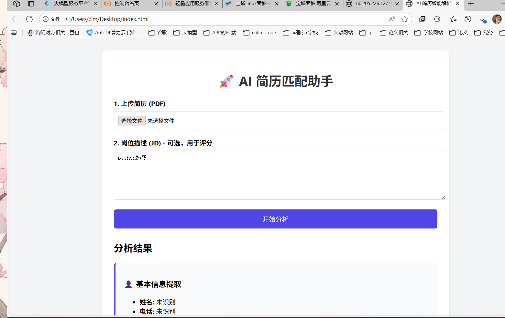
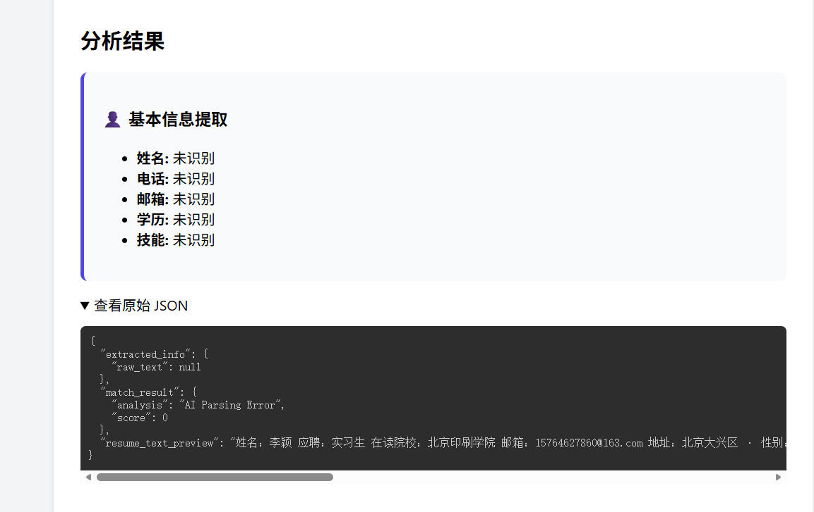

-----

````markdown
# 🚀 AI 智能简历解析与匹配助手 (AI Resume Matcher)

> 基于 阿里云 DashScope (通义千问) + Python Flask 构建的智能招聘辅助工具。

本项目提供了一个 RESTful API 服务，支持上传 PDF 简历，利用大语言模型 (LLM) 自动提取关键信息（姓名、电话、技能等），并根据给定的岗位描述 (JD) 进行匹配度打分。

## ✨ 核心功能

1.  简历解析: 支持 PDF 格式简历上传，使用 `pdfplumber` 提取文本。
2.  AI 关键信息提取: 调用 通义千问 (Qwen-Turbo) 模型，智能提取姓名、联系方式、学历、工作年限和技能点。
3.  人岗匹配打分: 结合岗位描述 (JD) 与简历内容，AI 自动生成 0-100 的匹配评分及分析建议。
4.  轻量级架构: 后端基于 Flask，部署灵活（支持 Docker/Serverless/VPS）。

## 🛠️ 技术栈

* 后端框架: Python 3.9 + Flask
* AI 模型: 阿里云 DashScope (Qwen-Turbo)
* PDF 处理: pdfplumber
* 部署环境: 阿里云轻量应用服务器 (宝塔 Linux 面板) + Nohup 后台运行
* 前端: HTML5 + Vanilla JS (单页应用)

---

## 📂 项目结构

```text
├── main.py              # 后端核心逻辑 (API 接口)
├── requirements.txt     # Python 依赖列表
├── index.html           # 前端交互页面
├── pic                  # 项目图片
└── README.md            # 项目文档
````

-----

## 🚀 部署流程 (阿里云轻量应用服务器)

本项目已在 阿里云轻量应用服务器 (CentOS + 宝塔面板) 环境下验证通过。

### 1\. 环境准备

  * 服务器: 阿里云轻量应用服务器 (2vCPU / 4GiB)
  * 系统: CentOS / Alibaba Cloud Linux
  * 面板: 宝塔 Linux 面板 (安装 Python 项目管理器)
  * 防火墙: 需在阿里云控制台和宝塔面板同时放行 9000 端口 (TCP)。

### 2\. 代码上传

将 `main.py` 和 `requirements.txt` 上传至服务器目录，例如：
`/www/wwwroot/resume_api/`

### 3\. 创建虚拟环境

1.  在宝塔“Python项目管理器”中添加项目。
2.  Python 版本选择 Python 3.9 或以上 (DashScope SDK 需要)。
3.  注意: 项目创建后，宝塔会自动在目录内生成一个哈希命名的虚拟环境文件夹 (例如 `8a5da5..._venv`)。

### 4\. 安装依赖 (关键步骤)

由于环境权限隔离问题，建议通过终端指定虚拟环境的 `pip` 进行安装：

```bash
cd /www/wwwroot/resume_api

# 使用通配符找到虚拟环境的 pip 并安装依赖 (使用阿里源加速)
./*_venv/bin/pip install -r requirements.txt -i [https://mirrors.aliyun.com/pypi/simple/](https://mirrors.aliyun.com/pypi/simple/)
```

### 5\. 配置环境变量

在 `main.py` 中或通过系统环境变量设置你的阿里云 API Key：

```python
# main.py 顶部或环境变量
DASHSCOPE_API_KEY = "sk-xxxxxxxxxxxxxxxxxxxxx"
```

### 6\. 启动服务 (后台运行)

为了避免宝塔权限冲突，使用 `root` 权限通过 `nohup` 在后台启动服务，监听 9000 端口：

```bash
# 停止宝塔中的项目，直接在终端执行：
nohup /www/wwwroot/resume_api/*_venv/bin/python3 /www/wwwroot/resume_api/main.py > /www/wwwroot/resume_api/run.log 2>&1 &
```

检查是否运行成功：

```bash
tail -f /www/wwwroot/resume_api/run.log
# 输出: Running on [http://0.0.0.0:9000](http://0.0.0.0:9000)
```

-----

## 💻 前端使用说明

1.  打开 `index.html` 文件。
2.  修改 API 地址配置（指向你的服务器公网 IP）：

<!-- end list -->

```javascript
// index.html 第 80 行左右
const API_URL = "[http://60.205.226.127:9000/analyze](http://60.205.226.127:9000/analyze)"; 
```

3.  双击打开 `index.html` 或将其部署到 GitHub Pages。
4.  上传 PDF 简历 -\> 输入岗位描述 -\> 点击“开始分析”。

-----


## 📝 API 文档

### 简历分析接口

  * URL: `/analyze`
  * Method: `POST`
  * Content-Type: `multipart/form-data`

| 参数名 | 类型 | 必填 | 描述 |
| :--- | :--- | :--- | :--- |
| `resume` | File | 是 | PDF 格式简历文件 |
| `jd_text` | Text | 否 | 岗位描述文本 (用于计算匹配分) |

响应示例 (JSON):

```json
{
  "extracted_info": {
    "name": "张三",
    "email": "zhangsan@example.com",
    "phone": "13800138000",
    "skills": ["Python", "Flask", "Machine Learning"],
    "education": "某某大学 计算机科学 本科"
  },
  "match_result": {
    "score": 85,
    "analysis": "候选人具备 Python 开发经验，与岗位需求高度匹配..."
  }
}
```

-----

